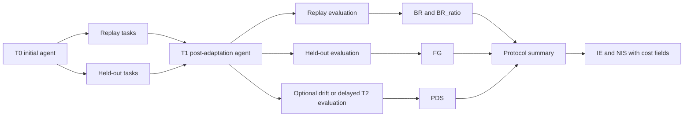

# SI-Protocol Benchmark (SIP-Bench)

## Repository Description

SIP-Bench is open-source protocol infrastructure that turns episodic benchmark runs into longitudinal, reproducible evaluations for agent self-improvement. It answers whether gains are real, retained, stable over time, and worth their cost—not just whether one final score is higher.

`SIP-Bench` is a protocol layer for evaluating self-improving agents across improvement, retention, and cost.

It does not introduce a new task world. It wraps existing benchmark environments with a shared longitudinal evaluation contract so you can ask questions that single-shot leaderboards usually cannot answer:

1. Did the agent improve on held-out tasks?
2. Did it retain performance on tasks it already knew?
3. What interaction, compute, and operational cost did that improvement require?

## Why This Is Different

Most agent benchmarks report a score for one run on one split. `SIP-Bench` instead standardizes a reusable protocol:

1. `T0 / T1 / T2` checkpoints
2. `replay / adapt / heldout / drift` task partitions
3. normalized run records and summary records
4. metrics for gain, retention, and efficiency
5. first-class recording of failed benchmark executions

The project is best understood as research infrastructure for measuring self-improvement, not as another benchmark wrapper and not as a new benchmark environment.

## Protocol At A Glance



## v0.1.0 Release Posture

The published `v0.1.0` release is optimized for a strong open-source launch:

1. official support target: `Linux-first`
2. release-critical environments:
   - `SkillsBench`
   - `tau-bench`
3. release-critical evidence:
   - real `SkillsBench oracle` suite artifacts
   - `tau-bench` historical/import-only protocol artifacts
4. experimental but non-blocking:
   - `SkillsBench codex external prepared suite`
   - `tau-bench` live runs that require provider credentials

Milestone, release-tracking, and post-release docs are collected in the documentation index:

1. [docs/README.md](docs/README.md)
2. [docs/repository_structure.md](docs/repository_structure.md)
3. [docs/overview.md](docs/overview.md)
4. [docs/results_gallery_post_v0_1.md](docs/results_gallery_post_v0_1.md)

## Supported Environments

| Environment | Current status | Release role |
| --- | --- | --- |
| `SkillsBench` | Real planning, hydration, execution import, and suite aggregation implemented | Primary release path |
| `tau-bench` historical | Import-only suite path implemented and aggregated | Secondary release path |
| `tau-bench` live | Runtime wrapper and preflight exist, requires provider credentials | Optional |
| `SkillsBench codex prepared` | Task preparation layer exists, validation is still experimental | Optional |

## Protocol Model

Lifecycle phases:

1. `T0`: initial agent
2. `T1`: post-adaptation checkpoint
3. `T2`: delayed or post-drift checkpoint

Task partitions:

1. `replay`
2. `adapt`
3. `heldout`
4. optional `drift`

Primary metrics:

1. `FG`: Forward Gain
2. `BR`: Backward Retention
3. `BR_ratio`
4. `IE`: Improvement Efficiency
5. `PDS`: Post-Delay Stability
6. `NIS`: Net Improvement Score

Schemas and protocol references:

1. [protocol/protocol_spec_v0.md](protocol/protocol_spec_v0.md)
2. [schemas/runs.schema.json](schemas/runs.schema.json)
3. [schemas/summary.schema.json](schemas/summary.schema.json)
4. [schemas/protocol_suite.schema.json](schemas/protocol_suite.schema.json)

## Quickstart

The commands below avoid private agent access and work with the repository's local fixtures and tracked sample outputs.

```bash
python3 scripts/run_release_checks.py
python3 -m unittest discover -s tests -p "test_*.py"
python3 scripts/aggregate_metrics.py --runs results/dryrun/sample_runs.jsonl --out /tmp/sip_summary.jsonl
python3 scripts/run_eval.py import-skillsbench-job --job-dir tests/fixtures/skillsbench_harbor_job_sample --out /tmp/skillsbench_job_runs.jsonl --benchmark-split smoke --phase T0 --path-type oracle --seed 21 --registry tests/fixtures/skillsbench_registry_sample.json --agent-version fixture-import --benchmark-version skillsbench-harbor-fixture
python3 scripts/validate_records.py --data /tmp/skillsbench_job_runs.jsonl --schema runs
```

What this gives you:

1. local unit coverage for protocol logic
2. a generated `summary.jsonl` from sample runs
3. a real-format `SkillsBench` Harbor job imported into SIP-Bench run records
4. schema validation on the imported artifact

If you want the same checks as the release path and CI, start with:

```bash
python3 scripts/run_release_checks.py
```

## Representative Artifacts

Tracked example outputs and configs:

1. Real `SkillsBench` suite report: [results/protocol_runs/skillsbench_oracle_real_suite/suite_report.json](results/protocol_runs/skillsbench_oracle_real_suite/suite_report.json)
2. Real `SkillsBench` summary: [results/protocol_runs/skillsbench_oracle_real_suite/summary.jsonl](results/protocol_runs/skillsbench_oracle_real_suite/summary.jsonl)
3. Tracked sample summary with non-trivial `FG/BR/PDS/IE`: [results/dryrun/summary.jsonl](results/dryrun/summary.jsonl)
4. Successful `SkillsBench` smoke import: [results/dryrun/skillsbench_dialogue_timeout4_runs.jsonl](results/dryrun/skillsbench_dialogue_timeout4_runs.jsonl)
5. Sample `tau-bench` imported runs: [results/dryrun/tau_runs.jsonl](results/dryrun/tau_runs.jsonl)
6. Real `SkillsBench` suite config: [protocol/skillsbench_oracle_real_suite.json](protocol/skillsbench_oracle_real_suite.json)
7. Experimental prepared-suite config: [protocol/skillsbench_codex_external_prepared_suite.json](protocol/skillsbench_codex_external_prepared_suite.json)
8. Historical `tau-bench` suite config: [protocol/tau_bench_retail_historical_suite.json](protocol/tau_bench_retail_historical_suite.json)
9. Optional live `tau-bench` smoke config: [protocol/tau_bench_retail_openai_smoke_suite.json](protocol/tau_bench_retail_openai_smoke_suite.json)

## What to Read First (2-3 Minutes)

1. Read the scope and architectural boundaries first:  
   [docs/positioning_note_post_v0_1.md](docs/positioning_note_post_v0_1.md)  
   [docs/results_gallery_post_v0_1.md](docs/results_gallery_post_v0_1.md)
2. Verify the minimum execution chain next:  
   `python3 scripts/run_release_checks.py`  
   `python3 scripts/evidence_gate.py --summary results/dryrun/summary.jsonl`
3. Then inspect the result path:  
   [docs/evidence_readme.md](docs/evidence_readme.md)  
   `docs/results_table_data/protocol_summary_snapshot.csv`
   `docs/figures/*.svg`

## Minimal Value Proof

The smallest tracked proof that `SIP-Bench` adds value beyond a single-shot score is [results/dryrun/summary.jsonl](results/dryrun/summary.jsonl), which is derived from [results/dryrun/sample_runs.jsonl](results/dryrun/sample_runs.jsonl).

It intentionally shows a case where adaptation helps held-out tasks but slightly hurts replay performance and slips again at `T2`.

| Protocol view | Value | Why a plain score would miss it |
| --- | --- | --- |
| Held-out mean `T0 -> T1` | `0.250 -> 0.425` | Looks like a clean improvement on new tasks |
| Replay mean `T0 -> T1` | `0.600 -> 0.525` | Shows retention loss that the held-out gain hides |
| Held-out mean `T1 -> T2` | `0.425 -> 0.405` | Shows post-improvement slippage instead of one stable final score |
| Adapt cost mean | `75` tokens, `2` tool calls, `4.0s` | Makes the gain costed instead of free |
| Derived protocol metrics | `FG = +0.175`, `BR = -0.075`, `PDS = -0.020`, `IE = 0.0025` | Summarizes the tradeoff directly instead of leaving it implicit |

A plain post-adaptation score of `0.425` on held-out tasks would suggest "the agent improved." The protocol view is stricter: yes, held-out performance improved, but replay performance regressed, the gain softened by `T2`, and the improvement had an explicit interaction cost. That is the core reason `SIP-Bench` exists.

The real `SkillsBench oracle` suite remains the release-critical evidence that the protocol works on a live benchmark path. The dry-run summary above is the compact release-facing example that shows why the protocol is useful.

## Non-Ceiling Definition

A run family is considered non-ceiling when protocol dynamics are still informative instead of saturated at near-perfect task completion:

1. any metric in `{t0_replay_mean, t1_replay_mean, t0_heldout_mean, t1_heldout_mean, t2_heldout_mean, t2_replay_mean}` drops below `1 - ceiling_gap` where `ceiling_gap = 0.02`, or
2. `abs(FG)` or `abs(BR)` reaches `>= 0.02`, or
3. `abs(IE)` reaches `>= 0.0005`.

The suite evidence gate additionally requires at least `min_repeat_count = 3` attempt attempts before a status can be upgraded to `evidence`.
Otherwise, results are kept as `screening` for recovery/protocol-debugging visibility.

For offline checks, run:

```bash
python3 scripts/evidence_gate.py --summary <path>/summary.jsonl
```

For the stronger post-`v0.1.0` table-and-figure package built from tracked artifacts, see [docs/results_gallery_post_v0_1.md](docs/results_gallery_post_v0_1.md).

## Real Benchmark Paths

### SkillsBench

Current real path:

1. build an explicit plan
2. hydrate the sparse checkout
3. execute through Harbor
4. import the Harbor job directory
5. validate `runs.jsonl`

The current multi-run suite runner supports:

1. per-run planning
2. per-run hydration
3. optional run-local task preparation
4. optional per-run `retry_policy` with attempt-level artifacts for transient infrastructure failures
5. per-run execution or import-only mode
6. combined `runs.jsonl`
7. aggregated `summary.jsonl`

The current tracked real suite is an orchestration validation suite, not a claim of meaningful self-improvement.
It now runs through auditable prepared task copies for the release-critical `dialogue-parser` and `citation-check` tasks so Linux validation can harden task-local environment issues without mutating the upstream checkout, including a validated Python-runtime fallback for `citation-check`.

### tau-bench

Current supported paths:

1. `historical/import-only`
2. `live` with explicit provider credentials

The current release-safe path is the historical suite because it does not depend on private API access.

The live smoke path is configured but requires provider credentials. A checked-in template lives at [protocol/tau_openai.env.example](protocol/tau_openai.env.example).

## Task Preparation Layer

For `SkillsBench`, suite configs can optionally prepare run-local task copies instead of mutating the upstream checkout.

Supported preparation features:

1. `mode = source`
2. `mode = copy`
3. `skill_mode = strip|keep`
4. explicit task patches such as `offer_letter_generator_system_docx`

This layer is what enables frozen-style versus skill-enabled comparisons without rewriting upstream tasks in place.

## Repository Map

1. [docs/README.md](docs/README.md) — full documentation index by purpose
2. [docs/repository_structure.md](docs/repository_structure.md) — concise structural orientation
3. [docs/overview.md](docs/overview.md) — project story and positioning
4. [docs/technical_design.md](docs/technical_design.md) — protocol architecture
5. [docs/evidence_readme.md](docs/evidence_readme.md) — reproducible evidence workflow
6. [docs/results_gallery_post_v0_1.md](docs/results_gallery_post_v0_1.md) — key visual outputs
7. [src/sip_bench/](src/sip_bench) — protocol implementation
8. [tests/README.md](tests/README.md) — validation scope

## Repository Structure (Brief)

Read this page first for a quick full-project overview: [docs/repository_structure.md](docs/repository_structure.md)

You should learn three key points:

1. Core source code lives in `src/` and `scripts/`; everything else is configuration, evidence, or outputs.
2. `protocol/` and `results/` are reproducibility evidence layers rather than the framework core.
3. Runtime-only artifacts are not part of the release surface (`.venv`, `.uv-cache`, `benchmarks/*`, `results/dryrun/artifacts/*`).

## Operational Notes

1. `Linux-first` is the official support target for `v0.1`.
2. Windows-specific helpers such as `scripts/harbor312.cmd` and `scripts/tau311.cmd` remain useful local wrappers, but they are not the center of the public support story.
3. Real `SkillsBench` runs may still need explicit timeout overrides for slow Docker tasks.
4. `tau-bench` live execution depends on provider credentials and is intentionally not a release blocker.
5. Upstream benchmark checkouts under `benchmarks/` are local dependencies and are not vendored into the repository release surface.

## FAQ

### Is this a new benchmark?

No. `SIP-Bench` is a protocol layer on top of existing benchmark environments.

### Does the first release require private API access?

No. The release-critical quickstart and tracked validation path do not require private model credentials.

### Is `codex` required?

No. Experimental prepared-suite support exists, but `codex` connectivity is not part of the `v0.1` release-critical path.

### What should I use if I only want a stable second environment today?

Use the tracked `tau-bench` historical/import-only path. It exercises the protocol layer without turning provider credentials into a blocker.

### Where are the evidence artifacts and how can they be reproduced?

1. Table outputs: `docs/results_table_data/protocol_summary_snapshot.csv` and `docs/results_table_data/protocol_summary_snapshot.json`
2. Figure outputs: `docs/figures/*.svg`
3. Reproduction commands: [docs/evidence_readme.md](docs/evidence_readme.md)

## License

The SIP-Bench code in this repository is licensed under [Apache-2.0](LICENSE).

External benchmark projects, datasets, and local upstream checkouts keep their own licenses and usage terms. See [NOTICE](NOTICE) for the release-surface clarification.
