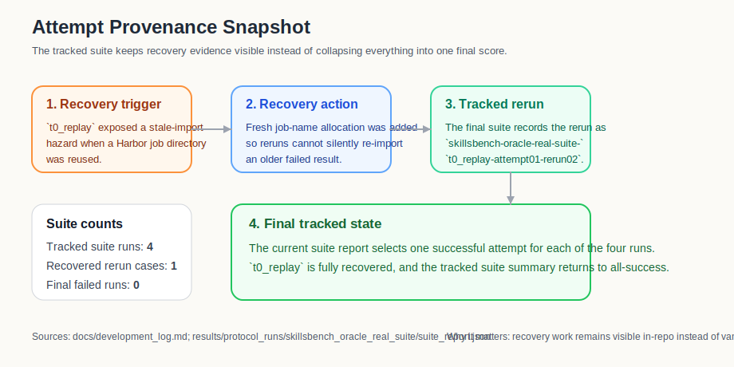
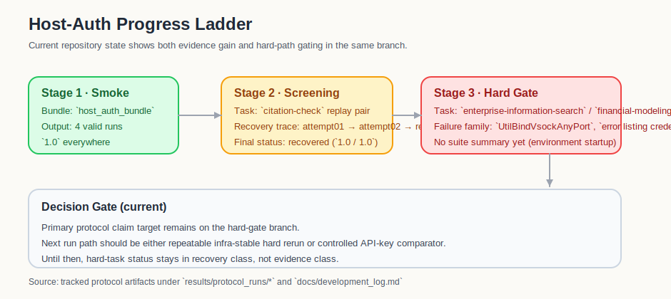

# SIP-Bench Post-v0.1 Results Gallery

This document is the first repo-hosted upgrade beyond the `v0.1.0` minimal proof-of-value.
It turns already tracked artifacts into compact tables and figures that can support README, release, or paper-facing claims without relying on private slides.

See also:

1. [Positioning note: protocol-first vs benchmark-first self-evolution evaluation](positioning_note_post_v0_1.md)

## Protocol Value Snapshot

| Evidence path | T0 heldout | T1 heldout | FG | T0 replay | T1 replay | BR | T2 heldout / PDS | Cost signal | Why it matters |
| --- | --- | --- | --- | --- | --- | --- | --- | --- | --- |
| `results/dryrun/summary.jsonl` | `0.250` | `0.425` | `+0.175` | `0.600` | `0.525` | `-0.075` | `0.405 / -0.020` | `75` tokens, `2` tool calls, `4.0s` | Improvement is real, but it costs budget, hurts replay retention, and softens by `T2` |
| `SkillsBench oracle real suite` | `1.000` | `1.000` | `0.000` | `1.000` | `1.000` | `0.000` | `n/a` | `184.16s` mean wall clock | The live protocol path is operationally valid, but this suite is evidence of execution correctness rather than improvement tradeoff |
| `SkillsBench codex external prepared suite` | `0.000` | `0.000` | `0.000` | `0.000` | `0.000` | `0.000` | `n/a` | `152.10s` mean wall clock | The full prepared suite now executes end to end on this host, but without `OPENAI_API_KEY` the Harbor `codex` agent collapses both strip and keep paths into flat-zero verifier outcomes |
| `SkillsBench codex host-auth custom-agent bundle` | `1.000` | `1.000` | `0.000` | `1.000` | `1.000` | `0.000` | `n/a` | `1031041` tokens, `601.54s` wall clock | A repo-local host-side `codex` agent can now produce a fully aggregated prepared-suite bundle with ChatGPT login state and no global Harbor edits; the current bundle is a real protocol artifact, but it is a ceiling-effect validation bundle rather than a tradeoff-revealing result |
| `SkillsBench codex host-auth hard-candidate bundle` | `n/a` | `n/a` | `n/a` | `n/a` | `n/a` | `n/a` | `n/a` | `n/a` | `enterprise-information-search` replay and `financial-modeling-qa` heldout were attempted, but no valid summary exists yet due repeated infra-level environment-build failures |
| `tau-bench historical/import-only` | `1.000` | `1.000` | `0.000` | `0.500` | `0.500` | `0.000` | `n/a` | `$0.01292` mean cost | Gives a second environment that is interpretable without private access, even though it is not yet a strong gain/retention stress test |

Primary tracked sources:

1. `results/dryrun/summary.jsonl`
2. `results/protocol_runs/skillsbench_oracle_real_suite/summary.jsonl`
3. `results/protocol_runs/skillsbench_codex_external_prepared_suite/summary.jsonl`
4. `results/protocol_runs/skillsbench_codex_external_prepared_t0_replay_host_agent_probe2/runs/t0_replay.jsonl`
5. `results/protocol_runs/skillsbench_codex_external_prepared_host_auth_bundle/summary.jsonl`
6. `results/protocol_runs/tau_bench_retail_historical_suite/summary.jsonl`

## Environment Coverage Table

| Path | Current status | Release role | What it is good for right now | Current limitation |
| --- | --- | --- | --- | --- |
| `SkillsBench oracle real suite` | Supported | Release-critical | Real planning, hydration, execution import, suite aggregation, and retry-aware provenance | Current tracked suite is mostly orchestration evidence, not a strong self-improvement result |
| `tau-bench historical/import-only` | Supported | Release-critical | Stable second environment without provider credentials | Historical/import-only path is weaker than live execution for operational realism |
| `SkillsBench codex external prepared` | Experimental, but now fully executable | Optional | Best candidate for stronger protocol-vs-self-evolution comparisons | The suite now completes end to end, but without `OPENAI_API_KEY` it produces a flat-zero summary that reflects credential failure more than capability |
| `SkillsBench codex host-auth custom agent` | Experimental, but now multi-run and summary-backed | Optional | Best candidate for using ChatGPT login state instead of API keys while preserving Harbor verification | The path is now viable for real bundles, but the current tracked task pair saturates at `1.0`, so stronger non-ceiling tasks are still needed for protocol-value claims |
| `SkillsBench codex host-auth hard candidate` | Experimental and blocked at run-time | Optional | Valuable as a hard-path infra gate and candidate for future non-ceiling protocol contrast | Repeated environment build signatures (`UtilBindVsockAnyPort`, `error listing credentials`) currently prevent a full suite summary |
| `tau-bench` live provider-backed execution | Experimental | Optional | Best candidate for a more realistic second live environment | Requires provider credentials and explicit budget |

Primary tracked sources:

1. `docs/support_matrix_v0_1.md`
2. `README.md`
3. tracked suite configs under `protocol/`

## Failure And Recovery Table

| Case | Initial signal | Protocol-visible evidence | Recovery action | Final result | What a plain final score would hide |
| --- | --- | --- | --- | --- | --- |
| `SkillsBench t0_replay` rerun | Earlier rerun imported a stale failed `dialogue-parser` result because the Harbor job directory was reused | `suite_report.json` now records a distinct rerun job name: `skillsbench-oracle-real-suite-t0_replay-attempt01-rerun02` | Added fresh rerun job-name allocation and reran only `t0_replay` via `--run-name` | `t0_replay` recovered to `score = 1.0`; suite summary returned to full success | Final suite success alone would erase the stale-import hazard and the engineering work needed to recover |
| Live suite execution in general | Docker / apt / environment issues can fail for infrastructure reasons rather than protocol logic | per-run `retry_policy`, `attempts/`, `preparation/`, and run-local provenance files are all tracked | keep retry policy explicit and preserve attempt-level artifacts | live suite remains auditable instead of looking like one opaque score | ordinary benchmark reporting usually compresses infra failure burden into one terminal status |
| `tau-bench historical` release path | second environment needed to be interpretable without private credentials | tracked historical suite summary is versioned and schema-valid | use import-only historical artifacts as the public second environment | release can show two environments without gating on live provider access | a simple support matrix would not show which path is actually reproducible today |
| `SkillsBench codex external prepared` full suite | the first probe failed in `dialogue-parser` Docker build, the second exposed missing model configuration, and the final tracked suite completed with a flat-zero summary | tracked `preparation/`, `attempts/`, `suite_report.json`, and probe artifacts show the progression from apt instability to explicit `model` wiring to `env_override_keys = []` and `0.0` verifier rewards across the final suite | add `dialogue_parser_apt_retry`, make the tracked config pass `model = "gpt-5.4"`, and thread SkillsBench env resolution through `.env.local` / `env_file` | the suite is now fully executable and schema-valid, but it still needs `OPENAI_API_KEY` to produce a meaningful non-zero comparison | a flat support label would hide both the engineering recovery and the fact that the remaining blocker is now credential state rather than protocol wiring |
| `SkillsBench codex host-auth custom-agent` bundle | Harbor's built-in container-side `codex` agent could not consume ChatGPT login state directly | the repo-local custom agent path now leaves tracked `host-workspace`, `codex.txt`, `trajectory.json`, `runs/*.jsonl`, and a generated `summary.jsonl` instead of only `401` logs | add `agent_import_path`, run `codex exec` on the host, sync outputs back into the task container, and keep Harbor for environment/verifier orchestration | the new four-run bundle reaches `T0/T1 replay/heldout` with all scores at `1.0` and a valid summary using account auth and no global Harbor edits | a simple "needs key" label is now wrong, but the new caveat is ceiling effect: this bundle proves execution viability more than gain/retention tradeoff |
| `citation-check` host-auth screening | the medium screening task first failed in verifier bootstrap, then failed in Docker credential-helper startup, then exposed a strip-specific runtime-patch bug | two tracked screening directories keep the progression visible: `skillsbench_codex_external_prepared_host_auth_citation_replay_probe/` and `..._runtime_hardened/` | add runtime-hardening, extend retry coverage for Docker credential drift, fix the strip-path patch so `citation_check_python_runtime` does not assume `environment/skills` exists, and rerun `t0_replay` as `...rerun03` | recovered replay runs now land at `T0 = 1.0` and `T1 = 1.0`, so the case is valuable as failure/recovery provenance but not as the main non-ceiling evidence bundle | a final replay score of `1.0` would completely hide the fact that three distinct infrastructure or patch issues had to be recovered before the task could even be evaluated cleanly |
| `SkillsBench host-auth hard-candidate` | hard-path replay/heldout pair is selected for non-ceiling capability pressure | `suite` config and attempt artifacts now hold deterministic failure families on hard tasks | no valid runs were emitted for the hard bundle before environment/build errors; protocol still preserves attempt metadata and command provenance | pending an infrastructure-stabilized rerun; no recovery result yet | without these artifacts the hard-path failure would be interpreted as a missing capability, rather than environment startup instability |

Primary tracked sources:

1. `docs/development_log.md`
2. `results/protocol_runs/skillsbench_oracle_real_suite/suite_report.json`
3. `results/protocol_runs/skillsbench_codex_external_prepared_suite/suite_report.json`
4. `results/protocol_runs/tau_bench_retail_historical_suite/summary.jsonl`
5. `results/protocol_runs/skillsbench_codex_external_prepared_t0_replay_probe/runs/t0_replay.jsonl`
6. `results/protocol_runs/skillsbench_codex_external_prepared_t0_replay_retry_probe/runs/t0_replay.jsonl`
7. `results/protocol_runs/skillsbench_codex_external_prepared_t0_replay_model_probe/runs/t0_replay.jsonl`
8. `results/protocol_runs/skillsbench_codex_external_prepared_t0_replay_host_agent_probe2/runs/t0_replay.jsonl`
9. `results/protocol_runs/skillsbench_codex_external_prepared_t0_heldout_host_agent_probe/runs/t0_heldout.jsonl`
10. `results/protocol_runs/skillsbench_codex_external_prepared_host_auth_bundle/summary.jsonl`
11. `results/protocol_runs/skillsbench_codex_external_prepared_host_auth_citation_replay_probe/suite_report.json`
12. `results/protocol_runs/skillsbench_codex_external_prepared_host_auth_citation_replay_probe_runtime_hardened/suite_report.json`
13. `results/protocol_runs/skillsbench_codex_external_prepared_host_auth_hard_candidate_bundle/attempts/t0_replay/attempt01.plan.json`

## Figures

### Heldout vs Replay Delta

Source:

1. `results/dryrun/summary.jsonl`

Interpretation:

1. the held-out line rises from `0.250` to `0.425`
2. the replay line falls from `0.600` to `0.525`
3. this is the smallest tracked example of why protocol structure adds value beyond a single post-adaptation score

### Cost vs Gain Summary

Source:

1. `results/dryrun/summary.jsonl`

Interpretation:

1. the tracked gain is small but positive
2. the gain is not free in token, tool, or time budget
3. `IE` stays visible next to raw cost signals so "improvement" is not discussed as if it were costless

### T0/T1/T2 Stability

Source:

1. `results/dryrun/summary.jsonl`

Interpretation:

1. the tracked held-out score rises sharply from `T0` to `T1`
2. the gain remains positive at `T2`
3. `PDS = -0.020` makes the softening explicit instead of letting `T1` stand in as the whole story

### Attempt Provenance Snapshot

Source:

1. `docs/development_log.md`
2. `results/protocol_runs/skillsbench_oracle_real_suite/suite_report.json`

Interpretation:

1. the `t0_replay` recovery path is now a tracked in-repo story instead of a hidden rerun
2. the suite keeps the rerun-specific job name visible: `...rerun02`
3. the final `1.0` suite summary is still useful, but no longer erases the engineering provenance behind recovery

### Host-Auth Progress

Source:

1. `docs/host_auth_experiment_design.md`
2. `docs/development_log.md`
3. `results/protocol_runs/skillsbench_codex_external_prepared_host_auth_bundle/*`
4. `results/protocol_runs/skillsbench_codex_external_prepared_host_auth_hard_candidate_bundle/*`

Interpretation:

1. the host-auth ladder now has a complete smoke artifact and a screened recovery artifact (`citation-check`)
2. hard-task exploration has exposed reproducible infra barriers before any non-ceiling protocol metric can be generated
3. the next evidentiary step is either stabilized rerun for the hard pair or a controlled `OPENAI_API_KEY` comparator

## Remaining Gaps

1. the next high-value upgrade is a stronger non-ceiling host-auth bundle so replay vs heldout behavior is measured on tasks that do not all saturate at `1.0`; `citation-check` has now been screened and recovered, but it still lands in the ceiling bucket
2. if the host-auth path stalls on harder task selections, the fallback remains rerunning the prepared suite with `OPENAI_API_KEY` so the comparison reflects capability instead of credential failure
3. once a stronger prepared-suite comparison exists, the gallery should add a protocol-first vs benchmark-first comparison table
4. the current provenance chart is based on one strong recovery case; a second tracked recovery family would make this part of the story materially stronger
