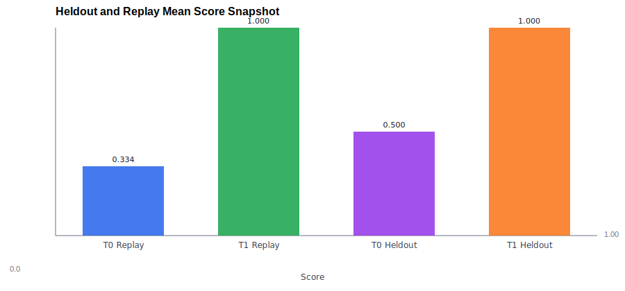
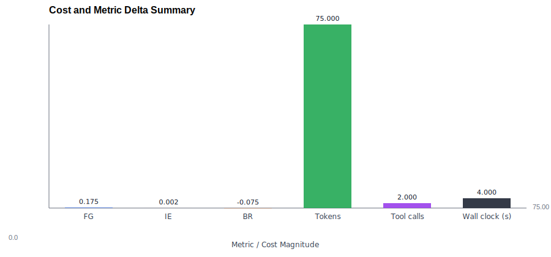
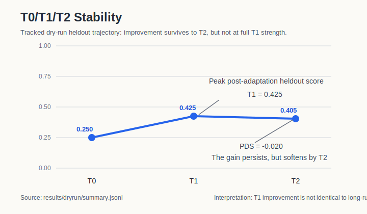

# SIP-Bench Post-v0.1 Results Gallery

This document is the first repo-hosted upgrade beyond the `v0.1.0` minimal proof-of-value.
It turns already tracked artifacts into compact tables and figures that can support README, release, or paper-facing claims without relying on private slides.

See also:

1. [Positioning note: protocol-first vs benchmark-first self-evolution evaluation](positioning_note_post_v0_1.md)

## Protocol Value Snapshot

| Evidence path | T0 heldout | T1 heldout | FG | T0 replay | T1 replay | BR | T2 heldout / PDS | Cost signal | Why it matters |
| --- | --- | --- | --- | --- | --- | --- | --- | --- | --- |
| `results/dryrun/summary.jsonl` | `0.250` | `0.425` | `+0.175` | `0.600` | `0.525` | `-0.075` | `0.405 / -0.020` | `75` tokens, `2` tool calls, `4.0s` | Improvement is real, but it costs budget, hurts replay retention, and softens by `T2` |
| `SkillsBench oracle real suite` | `1.000` | `1.000` | `0.000` | `1.000` | `1.000` | `0.000` | `n/a` | `184.16s` mean wall clock | The live protocol path is operationally valid, but this suite is evidence of execution correctness rather than improvement tradeoff |
| `tau-bench historical/import-only` | `1.000` | `1.000` | `0.000` | `0.500` | `0.500` | `0.000` | `n/a` | `$0.01292` mean cost | Gives a second environment that is interpretable without private access, even though it is not yet a strong gain/retention stress test |

Primary tracked sources:

1. `results/dryrun/summary.jsonl`
2. `results/protocol_runs/skillsbench_oracle_real_suite/summary.jsonl`
3. `results/protocol_runs/tau_bench_retail_historical_suite/summary.jsonl`

## Environment Coverage Table

| Path | Current status | Release role | What it is good for right now | Current limitation |
| --- | --- | --- | --- | --- |
| `SkillsBench oracle real suite` | Supported | Release-critical | Real planning, hydration, execution import, suite aggregation, and retry-aware provenance | Current tracked suite is mostly orchestration evidence, not a strong self-improvement result |
| `tau-bench historical/import-only` | Supported | Release-critical | Stable second environment without provider credentials | Historical/import-only path is weaker than live execution for operational realism |
| `SkillsBench codex external prepared` | Experimental | Optional | Best candidate for stronger protocol-vs-self-evolution comparisons | Needs a machine that can actually access the target agent |
| `tau-bench` live provider-backed execution | Experimental | Optional | Best candidate for a more realistic second live environment | Requires provider credentials and explicit budget |

Primary tracked sources:

1. `docs/support_matrix_v0_1.md`
2. `README.md`
3. tracked suite configs under `protocol/`

## Failure And Recovery Table

| Case | Initial signal | Protocol-visible evidence | Recovery action | Final result | What a plain final score would hide |
| --- | --- | --- | --- | --- | --- |
| `SkillsBench t0_replay` rerun | Earlier rerun imported a stale failed `dialogue-parser` result because the Harbor job directory was reused | `suite_report.json` now records a distinct rerun job name: `skillsbench-oracle-real-suite-t0_replay-attempt01-rerun02` | Added fresh rerun job-name allocation and reran only `t0_replay` via `--run-name` | `t0_replay` recovered to `score = 1.0`; suite summary returned to full success | Final suite success alone would erase the stale-import hazard and the engineering work needed to recover |
| Live suite execution in general | Docker / apt / environment issues can fail for infrastructure reasons rather than protocol logic | per-run `retry_policy`, `attempts/`, `preparation/`, and run-local provenance files are all tracked | keep retry policy explicit and preserve attempt-level artifacts | live suite remains auditable instead of looking like one opaque score | ordinary benchmark reporting usually compresses infra failure burden into one terminal status |
| `tau-bench historical` release path | second environment needed to be interpretable without private credentials | tracked historical suite summary is versioned and schema-valid | use import-only historical artifacts as the public second environment | release can show two environments without gating on live provider access | a simple support matrix would not show which path is actually reproducible today |

Primary tracked sources:

1. `docs/development_log.md`
2. `results/protocol_runs/skillsbench_oracle_real_suite/suite_report.json`
3. `results/protocol_runs/tau_bench_retail_historical_suite/summary.jsonl`

## Figures

### Heldout vs Replay Delta

Source:

1. `results/dryrun/summary.jsonl`

Interpretation:

1. the held-out line rises from `0.250` to `0.425`
2. the replay line falls from `0.600` to `0.525`
3. this is the smallest tracked example of why protocol structure adds value beyond a single post-adaptation score

### Cost vs Gain Summary

Source:

1. `results/dryrun/summary.jsonl`

Interpretation:

1. the tracked gain is small but positive
2. the gain is not free in token, tool, or time budget
3. `IE` stays visible next to raw cost signals so "improvement" is not discussed as if it were costless

### T0/T1/T2 Stability

Source:

1. `results/dryrun/summary.jsonl`

Interpretation:

1. the tracked held-out score rises sharply from `T0` to `T1`
2. the gain remains positive at `T2`
3. `PDS = -0.020` makes the softening explicit instead of letting `T1` stand in as the whole story

## Remaining Gaps

1. attempt provenance should become a dedicated chart after one more repeatable failure-and-recovery run family is checked in
2. the next high-value upgrade is to add prepared-suite evidence, not to add a third benchmark prematurely
3. once a stronger prepared-suite comparison exists, the gallery should add a protocol-first vs benchmark-first comparison table
